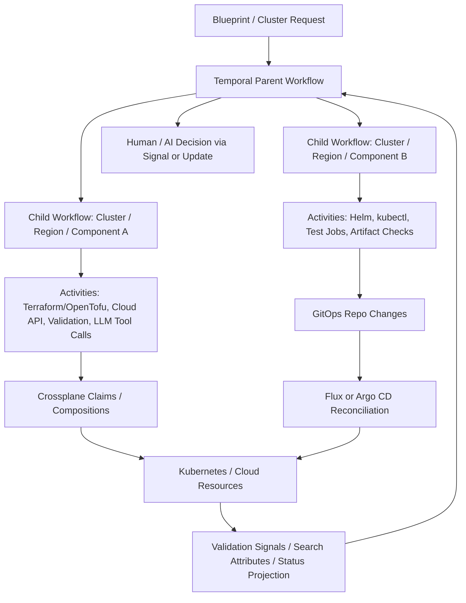

> [!WARNING] 非权威 AI 调研报告
> 本文件是 GitHub Copilot CLI 生成的调研报告，虽包含脚注和来源线索，但仍属于未经人工系统性复核的 AI 生成材料。不要直接把其中的产品能力、平台比较、选型结论或外部链接作为 wiki 结论证据；如需复用，必须重新核验一手来源，并在 `wiki/` 中建立明确的 claim-to-evidence 映射。

# Cluster Buildout Workflow Platform Selection Research

## Executive Summary

这个场景的核心不是“找一个能画 DAG 的工具”，而是选择一个能承载 **Blueprint 驱动、代码/AI/人工混合节点、局部失败隔离、受控回溯/追平、运行中流程演进** 的平台。原始需求明确 UI 只是加分项，因此主决策应优先看 durable execution、恢复模型、副作用边界、HITL/agent 消息语义和 infra desired-state 集成，而不是 UI 丰富度。[^1][^2][^3]

推荐路径是 **Temporal + Crossplane + GitOps（默认 Flux；若更重操作员 UI/手工回滚则 Argo CD）**。Temporal 负责流程状态、人/AI/代码协作、局部恢复和版本演进；Crossplane 负责集群/云资源 desired state 与持续纠偏；Flux 或 Argo CD 负责 Kubernetes 应用与配置的 GitOps 收敛。[^4][^5][^6][^7][^8][^9][^10]

Airflow 不建议作为主编排器。它适合有限、批处理、定时或数据/运维 DAG，能用 trigger rules、dynamic task mapping、deferrable sensors、backfill 和 UI 近似覆盖一部分 buildout 编排；但官方定位是 batch-oriented，且不适合持续运行的事件驱动/流式工作负载，复杂人机/agent 长链路状态也需要外置建模。[^11][^12][^13][^14][^15][^16]

若不想采用 Temporal，最值得 POC 的替代是 **Conductor/Orkes** 和 **Kestra**：前者在 dynamic forks、sub-workflows、replay/retry、human task、AI/LLM orchestration 上强；后者在 YAML-first、approval process、infra automation、UI 与 Terraform/OpenTofu 文档覆盖上强。Argo Workflows 适合 K8s job-first 的流水线，Step Functions 适合 AWS-first，Durable Functions 适合 Azure-first，Prefect 适合 Python-first 轻量动态流程。[^17][^18][^19][^20][^21][^22]

## 场景抽象与选型标准

原始请求描述的是从 Blueprint 起跑的 Cluster Buildout 流程：节点可以由代码机器执行、AI Agent 执行，或 AI 驱动人类执行；集成验证阶段允许局部失败，未受影响部分应继续推进，受影响部分应等待、追平或回溯；流程设计还可能在运行中继续调整。[^1]

因此，选型标准应按下面优先级排序：

| 维度 | 权重 | 说明 |
| --- | ---: | --- |
| 恢复语义与局部失败隔离 | 30% | 是否能把受影响分支隔离、补跑、追平，而不是全局失败或全量重跑。[^1][^2] |
| 异构节点与副作用边界 | 25% | code、AI、human 都应成为受控副作用/消息边界，而不是散落在 out-of-band 操作里。[^1][^3] |
| 运行中演进与版本化 | 20% | 流程在运行中继续调整，需要 versioning、reset、continue-as-new、replay 或等价机制。[^1][^23] |
| Infra/Kubernetes/GitOps 适配 | 15% | Cluster buildout 需要和 Kubernetes、Terraform/OpenTofu、Helm/Kustomize、GitOps、secrets 与 drift correction 对齐。[^7][^8][^9][^10] |
| UI/观测/操作员体验 | 10% | UI 是加分项，不是硬约束；但 history、search、audit、manual control 会影响运维效率。[^1][^24] |

硬性淘汰条件：只能静态 DAG 且缺乏局部恢复；只能做资源 desired-state 而没有流程控制；只能做 agent loop 但没有 durable audit/replay/side-effect boundary；人工审批只能靠外部手工流程拼接。[^1][^2][^3]

## 推荐总体架构



Temporal 在这个架构中是过程状态机，不负责持续纠偏；Crossplane 是平台/集群 desired-state control plane；Flux/Argo CD 是部署 reconciler。这个分层避免把 workflow 引擎误用成 drift controller，也避免把 GitOps 或 Crossplane 误用成长期人机流程引擎。[^4][^5][^6][^7][^8][^9][^10]

## Temporal vs Airflow

### Temporal

Temporal 的核心优势是 durable execution：Workflow Execution 通过 Event History 和 replay 恢复状态，Workflow 代码保持确定性，外部世界交互放入 Activities。这个模型天然适合长生命周期、多步骤、可恢复、有外部消息注入的流程。[^4][^5][^6]

对本场景，Temporal 可采用 Parent Workflow + Child Workflows 分解 Blueprint；每个 cluster、region、component 或验证域可以独立成 child execution。这样受影响分支可以单独 reset、continue-as-new、retry 或等待外部信号，未受影响分支继续推进。Signals/Updates 适合人工审批、AI 结果回传、外部验证事件和变更请求；Worker Versioning、patching 与 Continue-As-New 适合长跑流程的受控演进。[^17][^23][^25][^26][^27]

Temporal 的主要风险是工程纪律：workflow code 必须 deterministic；Activities 要幂等；大 payload、secrets、频繁查询或人工审批状态不宜直接塞进 history；长跑 workflow 需要 history size、Continue-As-New、worker versioning、Search Attributes 和状态投影策略。[^5][^6][^23][^24][^28]

### Airflow

Airflow 的优势是成熟的 DAG 调度、Python 生态、UI、backfill、失败任务重跑、dynamic task mapping、asset scheduling、sensors/deferrable operators。对于有限阶段的批处理/运维任务流，它可以务实地覆盖 buildout 的一部分：例如把 Blueprint 转成 DAG run config，用 dynamic mapping fan-out 节点验证，用 trigger rules 允许未失败分支继续，用 deferrable sensors 等待外部信号。[^11][^12][^13][^15][^16]

但 Airflow 官方定位是 batch-oriented，并明确不适合持续运行的事件驱动或流式工作负载。它的恢复对象主要是 DagRun/TaskInstance，而不是程序栈或 branch-local durable execution；XCom 只适合小数据且不应作为复杂持久状态层；DAG 版本和运行中拓扑变化需要严格部署纪律。[^11][^12][^14][^15][^16]

因此，Airflow 只有在这些条件满足时才值得作为主平台：团队已有成熟 Airflow 运维能力；buildout 基本是有限 DAG；人机/AI 交互很少且可外置；局部失败只要求重跑 task，而非追踪复杂分支状态。否则它更适合作为某些批处理/验证子流程，而不是主状态机。[^11][^12][^15][^16]

## 替代方案评估

| 方案 | 适配度 | 适合场景 | 关键限制 |
| --- | --- | --- | --- |
| Temporal + Crossplane + Flux/Argo CD | 最高 | 长跑过程状态 + 人/AI/代码混合 + desired-state infra + GitOps 收敛 | 需要 Temporal deterministic/versioning 纪律；infra drift 交给 Crossplane/GitOps。[^4][^5][^6][^7][^8][^9][^10] |
| Conductor/Orkes + Crossplane/GitOps | 高 | JSON workflow、dynamic forks/sub-workflows、human task、AI/LLM orchestration 优先 | 自建 OSS 运维较重；cluster drift 仍需 Crossplane/GitOps。[^18] |
| Kestra + Crossplane/GitOps | 高 | YAML-first、审批流、Terraform/OpenTofu、UI、infra automation 一体化 | 部分高级 HITL/多租户能力可能在企业版；durable replay 语义不如 Temporal 清晰。[^19] |
| Argo Workflows + Crossplane + Flux/Argo CD | 中高 | 大多数步骤都是 Kubernetes Job/容器任务，验证/CI/批量 fan-out 很重 | 人机/agent 长流程语义较薄；不是 desired-state controller。[^20] |
| AWS Step Functions | 中高（AWS-first） | AWS 内长跑有审计流程、callback token、人审、服务集成 | 云绑定明显；跨云/自托管 cluster buildout 不自然。[^21] |
| Azure Durable Functions | 中（Azure-first） | Azure Functions 体系内 durable orchestrator/activity/entity | Azure-centric；人机/agent UX 多需自建。[^22] |
| Prefect | 中 | Python-first、动态流程、轻量人机暂停、数据/运维混合 | 不像 Temporal 那样是强 replay 的 durable workflow engine。[^29] |
| Airflow | 中偏低（主平台）/中高（子流程） | 已有 Airflow，流程有限、批处理化、UI/backfill 重要 | 长跑交互式流程和 branch-local durable recovery 不自然。[^11][^12][^14][^15][^16] |
| Crossplane + GitOps 单独使用 | 低（主编排）/高（infra 层） | 资源 API、composition、drift correction、持续收敛 | 不是 workflow engine，不能单独承担 Blueprint -> AI/human/code 的过程控制。[^7][^8][^9][^10] |
| Dagster / 纯 agent 框架 | 低（主平台） | 资产血缘或 agent 节点实现层 | 不应承担主 durable orchestration/control-plane 角色。[^3][^30] |

## 局部失败、分叉和回溯模式

```mermaid
sequenceDiagram
    participant P as Parent Workflow
    participant A as Branch A Child Workflow
    participant B as Branch B Child Workflow
    participant H as Human/AI Review
    participant X as Crossplane/GitOps

    P->>A: start component A buildout
    P->>B: start component B buildout
    A->>X: apply desired state / run validation
    B->>X: apply desired state / run validation
    A-->>P: failed with scoped impact
    B-->>P: success; continue downstream
    P->>H: request decision / remediation plan
    H-->>P: signal/update approved fix
    P->>A: reset/retry/continue-as-new affected branch
    A-->>P: catches up
    P->>P: join and continue global validation
```

Temporal 的推荐建模是把可能独立失败和追平的域拆为 Child Workflows 或独立 workflow executions，而不是在一个巨大 workflow 中依赖单一全局状态。Conductor/Orkes 和 Kestra 对 dynamic forks、replay/restart、human task 或 pause/resume 的表达也较自然；Argo Workflows 可以用 DAG failFast、retry、suspend/resume 和 resubmit/retry 做 K8s workflow 层面的近似；Airflow 可用 trigger rules、dynamic mapping、backfill 和 task rerun 做 task-instance 层面的近似。[^17][^18][^19][^20][^12][^13][^15]

关键区别是恢复对象：Temporal 恢复的是 event-history-backed workflow execution；Conductor/Kestra 更接近 workflow execution 或 task/subflow replay；Airflow 恢复的是 DagRun/TaskInstance；Crossplane/GitOps 恢复的是 desired state/revision，而不是流程历史。这个差异决定了它们能否自然表达“受影响分支等待并追平，未受影响分支继续”。[^2][^17][^18][^19][^7][^8][^9][^10]

## 运维、UI 与成熟度

| 平台 | 运维负担 | UI/观测 | 成熟度判断 | 选型影响 |
| --- | --- | --- | --- | --- |
| Temporal Cloud | 低到中 | Web UI、metrics、Search Attributes、workflow history | 高 | 若预算允许，优先降低平台运维噪声，把精力放到 workflow 设计。[^24][^28] |
| Temporal Server 自建 | 中高 | 可用但需自管持久层、worker fleet、metrics | 高 | 适合必须自托管或数据本地性的团队。[^24][^28] |
| Airflow 自建 | 高 | UI 强，日志/backfill/DAG 操作成熟 | 高 | 若已有成熟 Airflow 平台可复用，否则为了本场景新建不划算。[^16] |
| Conductor OSS / Orkes | OSS 高；Orkes 中低 | workflow execution、metrics、human task、AI/LLM docs | 高 | AI-native 编排强替代，但仍需验证 OSS/托管边界。[^18] |
| Kestra OSS/EE/Cloud | OSS 中高；EE/Cloud 中低 | UI、审批、audit、infra automation 文档强 | 中高 | 若偏 YAML-first 和 UI/审批流，值得 POC。[^19] |
| Argo Workflows | 中高 | K8s/Argo UI、workflow archive、metrics | 高 | 适合 K8s-native job 编排，不适合作主 HITL 状态机。[^20] |
| Crossplane + Flux/Argo CD | 高但属于 infra 平台成本 | GitOps/drift/UI 取决于 Argo CD/Flux | 中高 | 必须作为 infra 收敛层评估，而不是拿来替代编排器。[^7][^8][^9][^10] |
| Step Functions / Durable Functions | 低 | 云控制台/云监控 | 高 | 仅在对应云优先时进入第一梯队。[^21][^22] |

## 推荐决策

### 首选：Temporal + Crossplane + Flux

这是默认推荐。Temporal 覆盖流程层的长跑状态、外部消息、人机协作、AI 结果注入、局部恢复和版本演进；Crossplane 把 cluster/platform resource model 做成声明式 API；Flux 负责 Kubernetes manifests、HelmRelease、Kustomization 的持续收敛和漂移修正。[^4][^5][^6][^7][^8][^9]

选择 Flux 而非 Argo CD 的默认理由是：如果 UI 不是硬需求，Flux 更适合作为轻量 GitOps reconciler；若团队更依赖操作员 UI、手工 sync、sync waves/hooks 和 rollback，可把 Flux 替换为 Argo CD。[^9][^10]

### 第二选择：Temporal + Crossplane + Argo CD

如果平台团队希望操作员能更直观看到应用/资源同步、手工回滚、sync waves 和 hooks，Argo CD 是更强的 GitOps UI/control-plane 选择。主编排仍建议由 Temporal 承担，避免把 Argo CD 当成过程状态机。[^10][^4][^5]

### 强替代：Conductor/Orkes 或 Kestra + Crossplane/GitOps

如果 AI-native orchestration、dynamic forks、human tasks 和 JSON workflow 是首要诉求，Conductor/Orkes 值得作为 Temporal 的强替代 POC。若 YAML-first、审批流、Terraform/OpenTofu 和 UI 集成更重要，Kestra 值得 POC。二者仍应配 Crossplane/GitOps 承担 infra desired state 与持续收敛。[^18][^19][^7][^8][^9][^10]

### 条件选择

Argo Workflows 适合绝大多数步骤都是 Kubernetes Job 或短生命周期容器任务的情况。Step Functions 适合 AWS-first 且愿意接受云锁定；Durable Functions 适合 Azure-first；Prefect 适合 Python-first 且流程动态性高但 durable replay 要求没那么强。[^20][^21][^22][^29]

### 不推荐

不推荐把 Airflow 作为这个场景的新建主平台，除非已有成熟 Airflow 基础设施并且需求可退化为有限 batch DAG。也不推荐只用 Crossplane/GitOps、Dagster 或纯 agent 框架当主平台，因为它们分别缺少流程控制、不是 cluster buildout 主过程引擎，或缺少 durable orchestration 边界。[^11][^12][^14][^15][^7][^8][^9][^10][^3][^30]

## POC 计划

### POC 1：混合节点闭环

构建一个最小 Blueprint：一个代码执行节点、一个 AI agent 节点、一个 human approval 节点、一个验证节点。验收标准是：每个节点的输入/输出可追踪，AI/human 结果能通过 Signal/Update 或等价机制进入 durable history，secrets 和大 payload 不进入 workflow history。[^6][^25][^28]

### POC 2：局部失败与追平

构建两个并行 component 分支，让 A 分支验证失败、B 分支继续成功；人工/AI 给出修复后，只重跑或 reset A 分支并追平到 join 点。验收标准是：不全量重跑；B 分支结果不丢失；A 分支修复历史可审计；join 后能继续全局验证。[^1][^17][^18][^19][^20]

### POC 3：运行中演进

在一次长跑 buildout 中变更 Blueprint 或 workflow 逻辑，测试 Temporal Worker Versioning/Continue-As-New/Reset，或替代平台的 replay/restart/versioning 能否安全承载活跃 run。验收标准是：旧 run 不被破坏，新逻辑可控进入，历史与审计链保持可解释。[^23][^17][^18][^19]

### POC 4：Infra desired-state 与 GitOps 收敛

用 Crossplane 把 Blueprint 中的 cluster/platform resource 抽象成 Claim/XRD/Composition；用 Flux 或 Argo CD 收敛 Helm/Kustomize；让 workflow 只提交 intent 或等待状态，而不是直接长期轮询所有资源细节。验收标准是：外部 drift 能被 Crossplane/GitOps 纠偏；workflow 能看到必要状态投影；rollback 通过 Git/revision 与 workflow compensation 分层处理。[^7][^8][^9][^10]

## Confidence Assessment

**高置信**：场景不是纯 Airflow 式 batch DAG；Temporal 比 Airflow 更适合作为主编排器；Crossplane/GitOps 应作为 infra desired-state 与部署收敛层；UI 不应成为主排序因素。这些判断直接来自原始场景约束、仓库已有 workflow 语义分析，以及 Temporal/Airflow/Crossplane/GitOps 官方文档。[^1][^2][^4][^5][^6][^7][^8][^9][^10][^11]

**中置信**：Conductor/Orkes 与 Kestra 是 Temporal 外最值得 POC 的替代。它们在 dynamic forks、human task、approval、infra automation 和 UI 方面与场景高度贴合，但具体托管/企业版边界、团队生态适配、许可证/成本与自托管复杂度需要实际验证。[^18][^19]

**低到中置信**：各平台的数值评分是基于场景权重和公开文档的工程判断，不是基准测试结果。建议把评分当作 POC 优先级，而不是最终采购分数。

**关键假设**：目标平台不强制限定单一云；团队可以接受一层 workflow orchestrator 加一层 infra desired-state control plane 的组合；AI agent 是节点执行者或决策辅助者，而不是不受约束的全局控制面；secrets、大 payload 和长期状态可以放入外部存储并通过引用进入 workflow。[^3][^6][^7][^8]

## Footnotes

[^1]: `raw/00-human-original-input/2026-06-12-cluster-buildout-platform-selection-request.md:18-31`
[^2]: `wiki/concepts/workflow-recovery-model.md:21-27`; `wiki/analyses/workflow-concepts-comparison.md:64-77`
[^3]: `wiki/concepts/workflow-side-effect-boundary.md:21-29`; `wiki/analyses/agent-orchestration-vs-workflow.md:37-66`
[^4]: Temporal official docs, "Workflow Executions", accessed 2026-06-13: `https://docs.temporal.io/workflow-execution`
[^5]: Temporal official docs, "Workflow Definitions", accessed 2026-06-13: `https://docs.temporal.io/workflow-definition`
[^6]: Temporal official docs, "Activity Definition" and idempotency guidance, accessed 2026-06-13: `https://docs.temporal.io/activity-definition`
[^7]: Crossplane official docs, "What's Crossplane?", accessed 2026-06-13: `https://docs.crossplane.io/latest/whats-crossplane/`
[^8]: Crossplane official docs, "Compositions" and "Managed Resources", accessed 2026-06-13: `https://docs.crossplane.io/latest/composition/`; `https://docs.crossplane.io/latest/managed-resources/managed-resources/`
[^9]: Flux official docs, accessed 2026-06-13: `https://fluxcd.io/flux/`; `https://fluxcd.io/flux/components/kustomize/kustomizations/`; `https://fluxcd.io/flux/components/helm/helmreleases/`
[^10]: Argo CD official docs, accessed 2026-06-13: `https://argo-cd.readthedocs.io/en/stable/`; `https://argo-cd.readthedocs.io/en/stable/user-guide/sync-waves/`; `https://argo-cd.readthedocs.io/en/stable/operator-manual/reconcile/`
[^11]: Apache Airflow official docs, stable index, accessed 2026-06-13: `https://airflow.apache.org/docs/apache-airflow/stable/index.html`
[^12]: Apache Airflow official docs, scheduler and architecture overview, accessed 2026-06-13: `https://airflow.apache.org/docs/apache-airflow/stable/administration-and-deployment/scheduler.html`; `https://airflow.apache.org/docs/apache-airflow/stable/core-concepts/overview.html`
[^13]: Apache Airflow official docs, sensors and deferrable operators, accessed 2026-06-13: `https://airflow.apache.org/docs/apache-airflow/stable/core-concepts/sensors.html`; `https://airflow.apache.org/docs/apache-airflow/stable/authoring-and-scheduling/deferring.html`
[^14]: Apache Airflow official docs, XComs, accessed 2026-06-13: `https://airflow.apache.org/docs/apache-airflow/stable/core-concepts/xcoms.html`
[^15]: Apache Airflow official docs, dynamic task mapping and backfill, accessed 2026-06-13: `https://airflow.apache.org/docs/apache-airflow/stable/authoring-and-scheduling/dynamic-task-mapping.html`; `https://airflow.apache.org/docs/apache-airflow/stable/core-concepts/backfill.html`
[^16]: Apache Airflow official docs, production deployment and task logging/monitoring, accessed 2026-06-13: `https://airflow.apache.org/docs/apache-airflow/stable/administration-and-deployment/production-deployment.html`; `https://airflow.apache.org/docs/apache-airflow/stable/administration-and-deployment/logging-monitoring/logging-tasks.html`
[^17]: Temporal official docs, child workflows, continue-as-new, reset, worker versioning and message passing, accessed 2026-06-13: `https://docs.temporal.io/child-workflows`; `https://docs.temporal.io/workflow-execution/continue-as-new`; `https://docs.temporal.io/workflow-execution/reset`; `https://docs.temporal.io/worker-versioning`; `https://docs.temporal.io/handling-messages`
[^18]: Conductor OSS official docs and source docs, accessed 2026-06-13: `https://docs.conductor-oss.org/`; `https://conductor-oss.github.io/conductor/`; `https://github.com/conductor-oss/conductor/blob/7f9adbf8bbecfe30cfa679b6c19595641740f7c0/docs/devguide/architecture/index.md`
[^19]: Kestra official docs, accessed 2026-06-13: `https://kestra.io/docs`; `https://kestra.io/docs/use-cases/infrastructure.md`; `https://kestra.io/docs/use-cases/approval-processes.md`; `https://kestra.io/docs/workflow-components/retries.md`; `https://kestra.io/docs/concepts/backfill.md`
[^20]: Argo Workflows official docs, accessed 2026-06-13: `https://argo-workflows.readthedocs.io/en/latest/`; `https://argo-workflows.readthedocs.io/en/latest/walk-through/dag/`; `https://argo-workflows.readthedocs.io/en/latest/walk-through/retrying-failed-or-errored-steps/`; `https://argo-workflows.readthedocs.io/en/latest/walk-through/suspending/`
[^21]: AWS Step Functions official docs, accessed 2026-06-13: `https://docs.aws.amazon.com/step-functions/latest/dg/welcome.html`
[^22]: Microsoft Learn, Azure Durable Functions overview, accessed 2026-06-13: `https://learn.microsoft.com/en-us/azure/durable-task/durable-functions/durable-functions-overview`
[^23]: `wiki/sources/temporal/workflow-versioning-docs.md:28-31`; `wiki/sources/temporal/continue-as-new-docs.md:28-35`; `wiki/sources/temporal/reset-docs.md:29-34`
[^24]: Temporal official docs, observability, web UI, Cloud HA and metrics, accessed 2026-06-13: `https://docs.temporal.io/evaluate/development-production-features/observability`; `https://docs.temporal.io/web-ui.md`; `https://docs.temporal.io/cloud/high-availability`; `https://docs.temporal.io/cloud/metrics`
[^25]: Temporal official docs, "Handling Messages" and "Sending Messages", accessed 2026-06-13: `https://docs.temporal.io/handling-messages`; `https://docs.temporal.io/sending-messages`
[^26]: `wiki/entities/temporal.md:21-39`; `wiki/analyses/workflow-concepts-comparison.md:91-99`
[^27]: Temporal official docs, "Activity Execution" async completion, accessed 2026-06-13: `https://docs.temporal.io/activity-execution`
[^28]: Temporal official docs, workers, worker performance, APS limits, cloud limits and namespaces, accessed 2026-06-13: `https://docs.temporal.io/workers`; `https://docs.temporal.io/develop/worker-performance`; `https://docs.temporal.io/best-practices/managing-aps-limits`; `https://docs.temporal.io/cloud/limits`; `https://docs.temporal.io/namespaces`
[^29]: Prefect official docs, accessed 2026-06-13: `https://docs.prefect.io/v3/get-started.md`; `https://docs.prefect.io/v3/concepts/tasks.md`; `https://docs.prefect.io/v3/advanced/interactive.md`; `https://docs.prefect.io/v3/how-to-guides/deployments/versioning.md`
[^30]: Dagster official docs and website, accessed 2026-06-13: `https://dagster.io/`; `https://docs.dagster.io/llms.txt`
