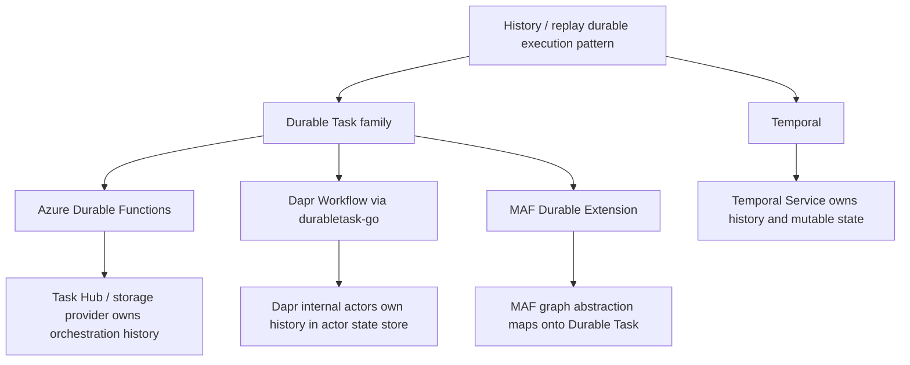

> [!WARNING] 非权威 AI 调研草稿
> 本文件是 GitHub Copilot CLI 生成的调研草稿。它用于为后续 `wiki/` 整合提供线索，不是权威技术事实来源，也不是最终架构结论。复用其中任何产品能力、机制比较、版本状态或外部链接前，必须回到一手文档、源码或已有 wiki source page 重新核验，并在 `wiki/` 中建立明确的 claim-to-evidence 映射。

# Azure Durable Functions 与 Dapr Workflow 纳入 Workflow Wiki 的调研草稿

## 调研边界与方法

本报告把 **Azure Durable Functions** 和 **Dapr Workflow** 纳入既有 workflow 系统比较框架。主对照对象是 **Temporal**；**Microsoft Agent Framework Workflow (MAF Workflow)**、**LangGraph Workflow** 和 **Apache Airflow** 只作为次要定位参照。目标读者是资深软件工程师，判断标准是机制与能力，而不是产品术语是否相同。

本报告的证据截止时间是 2026-06-15。调研优先使用 Microsoft Learn、Dapr docs、Temporal docs、官方 GitHub 仓库源码，以及本仓库已有 wiki 页面。所有结论均需在后续正式写入 `wiki/` 前重新核验。

## 执行摘要

Temporal、Azure Durable Functions 和 Dapr Workflow 都属于 **event-history / replay durable execution** 模式：workflow/orchestrator 代码在恢复时重新执行，已完成 activity/timer/event 的结果从历史中注入，因此 workflow 代码必须保持确定性。这个共同模式不能被写成单一实现谱系：Temporal 是独立的 Temporal Service + SDK 协议；Azure Durable Functions 基于 Durable Task Framework / Azure Functions 运行时；Dapr Workflow 在 `daprd` sidecar 中嵌入 `durabletask-go`，并把工作流状态落到 Dapr Actors 的状态存储中。[^temporal-history][^adf-orchestrations][^dapr-architecture][^dapr-durabletask-go]

与 Temporal 相比，Azure Durable Functions 更像 Azure-native / serverless-first 的 Durable Task 产品化入口。它的核心对象是 orchestrator、activity、entity functions；Task Hub 是状态命名空间和 pending-work 容器，不应等同于 Temporal 的 named Task Queue 路由抽象；External Events 是单向异步消息，不等价于 Temporal Update；Durable Entities 则提供 Temporal 没有的原生 actor-like stateful entity primitive。[^adf-taskhub][^adf-external-events][^adf-entities][^temporal-messages]

Dapr Workflow 与 Temporal 的最大差异不是“有没有 replay”，而是控制面和状态所有权。Dapr 把 workflow engine 放在每个应用旁边的 sidecar 中，应用通过出站 gRPC work-item stream 注册并执行 workflow/activity 逻辑；每个 workflow instance 对应 Dapr 内部 actor，history/inbox/metadata 存在 actor state store，timer 和部分唤醒路径使用 actor reminders。Temporal 则由独立 Temporal Service 的 History/Matching 等服务拥有 Event History、Mutable State 和 Task Queue 分发。[^dapr-sidecar-stream][^dapr-actor-state][^temporal-architecture][^temporal-taskqueue]

对 wiki 整合而言，最重要的新增比较轴不是“是否支持 Workflow”，而是：**history ownership / storage substrate、work-item delivery model、control plane ownership and portability、state truth source、side-effect boundary、interaction primitives、versioning/evolution model、history growth discipline**。

## 机制家族图

这个图只表示机制邻近性，不表示产品等价。Temporal、Azure Durable Functions 和 Dapr Workflow 都 replay code against history，但“谁写历史、谁调度下一步、谁拥有隔离命名空间、谁承诺一致性和版本路由”完全不同。

## Temporal 基线

Temporal 的核心设计是：每个 Workflow Execution 有 append-only Event History；worker 通过 workflow task replay 工作流代码，产生 Commands；Temporal Service 将 Commands 转换为 Events 并追加到历史。Activity 是副作用边界，具备 at-least-once 语义；已完成 Activity 的结果在 replay 时从历史中注入，不会重新执行。[^temporal-history][^temporal-lifecycle]

Temporal Service 是独立控制面，通常包含 Frontend、History、Matching 和 Worker Service。History Service 拥有 Workflow Execution 的 Event History、Mutable State 和内部任务队列；Matching Service 承载用户可见 Task Queues；workers 是用户自运维进程，通过 long-poll gRPC 从 Task Queue 拉取 Workflow/Activity Tasks，Temporal Service 不执行用户代码。[^temporal-architecture][^temporal-workers][^temporal-taskqueue]

Temporal 的交互模型比 Durable Task 家族更细：Signal 是异步 fire-and-forget 输入并写入历史；Query 是同步只读请求，不写历史；Update 是可验证、可返回结果、接受后写入历史的同步变更请求。这个 triad 对 human-in-the-loop 和外部控制面集成很关键，因为它区分了“异步通知”“只读观察”和“带结果的同步状态变更”。[^temporal-messages]

Temporal 还把历史增长和演进风险暴露得更直接：单个 Workflow Execution 有 Event History 条数与大小限制，长期 workflow 需要 Continue-As-New；Workflow code 的 command-generating 调用不能无版本地重排、添加或删除；Worker Versioning 和 patching / GetVersion 是官方演进工具。[^temporal-limits][^temporal-continue-as-new][^temporal-versioning]

## Azure Durable Functions

### 核心对象与执行模型

Azure Durable Functions 的核心 authoring surface 是 orchestrator functions、activity functions 和 entity functions。Orchestrator 通过 `await` / `yield` / 语言特定机制表达控制流；activity 承载外部副作用；entity 管理小型、可寻址、串行操作的持久状态。[^adf-overview][^adf-entities]

Durable Functions 使用 event sourcing：框架不直接存储 orchestration 当前内存快照，而是记录 orchestration 采取过的动作序列。Orchestrator 在有新事件时从头重新执行；如果执行到已经完成的 activity/timer/event，框架从 history 注入已记录结果，继续运行到下一个未完成 await 点。[^adf-orchestrations]

因此，orchestrator 代码必须确定性。系统时间应使用 `context.CurrentUtcDateTime`，GUID 应使用 `context.NewGuid()`，随机数、网络 I/O、文件 I/O、环境变量读取、线程/Task 调度、阻塞 sleep 等应移入 activity 或使用 Durable API。框架会尝试检测部分非确定性违规，但不会捕获所有违规。[^adf-code-constraints]

### Task Hub 与存储 Provider

Task Hub 是 Durable Functions 应用在存储中的状态表示，包含 orchestration/entity state、activity messages 和 instance messages。它首先是状态命名空间与 pending-work/message 容器，不是 Temporal Task Queue 那种开发者显式命名的 worker routing primitive。[^adf-taskhub]

Azure Storage provider 的典型物理布局包括 `History` table、`Instances` table、work-item queue、control queues、large-message blobs 和 partition/lease 元数据。Azure Storage provider 使用 tables + queues + blobs，因此文档明确提示 table 和 queue 之间没有事务一致性，provider 通过 eventual consistency pattern 处理失败。MSSQL provider、Netherite 和 Durable Task Scheduler 的一致性、吞吐、entity 支持、离线能力和扩缩容边界不同。[^adf-azure-storage][^adf-storage-providers]

当前文档把 Durable Task Scheduler 描述为推荐/高吞吐 Azure 托管后端；Azure Storage 是原始后端；MSSQL 是较可移植、支持 disconnected environment 的后端；Netherite 使用 Azure Event Hubs + FASTER，但已有停止支持时间线。正式 wiki 整合时，应按 provider 分列，而不是写成一个单一 Durable Functions 运行时属性。[^adf-storage-providers]

### 与 Temporal 的关键差异

Azure Durable Functions 与 Temporal 在 replay 模式上非常接近，但状态所有权和运维边界不同。Temporal 的 Event History 由 Temporal Service 的 History Service 管理，workers 长轮询 Task Queue；Durable Functions 的 history 由 storage provider / Task Hub 承载，执行环境通常是 Azure Functions host，Durable Task Scheduler 后端还有 gRPC push 型工作项交付，而 Azure Storage/MSSQL 后端仍有轮询语义。[^adf-taskhub][^adf-storage-providers][^temporal-architecture][^temporal-taskqueue]

Temporal 的 Signal/Query/Update 三分法没有 Durable Functions 的一一对应物。Durable Functions 的 External Events 是单向异步事件，适合审批、回调和 timeout 模式，但文档明确说它不适合 sender 需要同步响应的场景。Durable Functions 还有实例状态 API、custom status 和 Durable Entities 等机制，但没有 Temporal-style per-workflow Update handler with validator and result。[^adf-external-events][^temporal-messages]

Durable Entities 是 Durable Functions 的重要差异点。它们是 actor-like stateful entity primitive，具有 entity ID、串行 operation、持久状态和消息投递语义；Temporal 没有内置 Entity 类型，通常用 long-running workflow / workflow-per-entity / signals / Continue-As-New 组合建模。这个差异对 counter、lock、shopping cart、vote accumulator 等模式有实际工程影响。[^adf-entities]

版本演进不能简单写成“Azure 没有版本 API”。当前研究发现 Microsoft 文档已有 Orchestration Versioning / `context.Version` / `host.json` default version / version match strategy 等材料，但具体语言、extension bundle 和 runtime 最低版本需要正式写入 wiki 前重查。Temporal 的 Worker Versioning 和 patching 模型仍更偏 service-level worker routing / pinned-auto-upgrade 语义；Azure Durable Functions 更偏 orchestration instance version 与 host/runtime 匹配策略。[^adf-versioning][^temporal-versioning]

### 适用倾向

Azure Durable Functions 更适合 Azure-native、Azure Functions/serverless-first、希望用 Azure Storage / Durable Task Scheduler / Azure Monitor / Azure RBAC 降低控制面运维负担的团队。若团队强调跨云自托管、跨语言 worker fleet、显式 Task Queue 路由、Workflow Update、Worker Versioning 或长期历史治理纪律，Temporal 更自然。这个判断是机制推断，不是成本、SLA、团队熟练度或生态成熟度的最终选型结论。

## Dapr Workflow

### 核心对象与 sidecar 架构

Dapr Workflow 把 workflow engine 编译进 `daprd` sidecar，并使用 `dapr/durabletask-go` 作为 Durable Task 风格执行引擎。应用进程注册 workflow/activity 代码，通过出站 gRPC work-item stream 与本地 sidecar 交互；应用不需要暴露入站端口。sidecar 负责调度和持久化，应用执行用户逻辑并回传结果。[^dapr-architecture][^dapr-sidecar-stream][^dapr-durabletask-go]

Dapr Workflow 的内部 runtime 是 actor-based。每个 workflow instance 对应一个内部 workflow actor；activity invocation 也通过内部 activity actor 参与调度。workflow state 进入 Dapr actor state store，常见 key 包括 `metadata`、`inbox-NNNNNN`、`history-NNNNNN` 和 `customStatus`。保存路径使用事务性多 key 写入，并通过 ETag 处理并发/迁移冲突。[^dapr-actor-state][^dapr-source-state]

这意味着 Dapr Workflow 的 scaling 和 placement 语义来自 Dapr Actors：placement service 把 actor instance 分配到 sidecar host；workflow instance 一次只在一个 actor 上串行推进；activity actor 可以分布在不同 sidecar 上。它不是 Temporal 那种开发者命名 Task Queue + worker pool 路由模型。[^dapr-architecture][^dapr-source-runtime]

### Replay、timer、event、retry

Dapr Workflow 也使用 event sourcing：workflow 不保存内存快照，而是保存 history events；workflow function 在 replay 时从头运行，已完成 task 返回历史结果，未完成 await 处暂停。WorkflowContext 提供 `CurrentTimeUTC()`、`IsReplaying()`、`CallActivity()`、`CallChildWorkflow()`、`CreateTimer()`、`WaitForExternalEvent()`、`ContinueAsNew()` 和 `IsPatched()` 等 API。[^dapr-features][^dapr-source-workflow-api]

Durable timers 由 internal actor reminders 支撑；timer reminder 名称可按 timer ID 确定化，fire 后向 workflow history 注入 timer fired 事件。Dapr 的执行唤醒和失败重试也依赖 actor state/history/reactivation 路径；源码级研究还发现当前 reminder failure policy 使用 1 秒 constant interval 且无限重试，而部分 README 文本可能仍说 1 分钟，正式引用前要按当前版本源码核对。[^dapr-features][^dapr-source-timer][^dapr-source-reminder]

Dapr 的外部事件模型与 Azure Durable Functions 接近：`WaitForExternalEvent` / `RaiseEvent` 是一类命名事件机制，可以有 timeout，但没有 Temporal-style user-defined Query handler 或同步 Update handler。Dapr management API/CLI 可读取状态、历史、metadata、custom status，能 suspend/resume/terminate/purge，但这不是在 workflow code 内声明的 Query/Update 消息处理器。[^dapr-features][^dapr-management-gap][^temporal-messages]

Dapr Workflow 支持 retry policy、child workflow、Continue-As-New、patching 和 named workflow versioning。`IsPatched` / named versions 是 code-level determinism 工具；出现版本不匹配时 workflow 可能进入 stalled 状态，需要部署兼容代码恢复。它不等价于 Temporal 的 service-level Worker Deployment Versioning / Task Queue routing / pinned workflow 模型。[^dapr-versioning][^dapr-source-versioning][^temporal-versioning]

### 与 Temporal 的关键差异

Dapr 的根本差异是控制面位置：workflow scheduler 在 sidecar 内，状态在 Dapr actor state store 中，placement service 管 actor 分布；Temporal 的控制面是独立 server cluster，History Service owns workflow state，Matching Service owns task queues。Dapr 因此避免运行专门的 Temporal server，但引入 sidecar、placement、actor state store、Dapr runtime 配置和 actor-compatible transactional state store 依赖。[^dapr-architecture][^dapr-source-runtime][^temporal-architecture]

Dapr 的可移植性是真实优势：它可以运行在 Kubernetes、VM、Docker 或裸机，只要 Dapr runtime、placement 和兼容 state store 可用；状态存储可以随 Dapr component 切换。但这不是“零运维控制面”：sidecar 与 placement 本身就是运行时依赖，actor reminder 和 state store 延迟也会进入 workflow step latency。[^dapr-architecture][^dapr-concurrency]

Temporal 在交互原语、任务路由和历史治理上更完整：Signal/Query/Update 三分法、Task Queue routing、Activity heartbeat/timeouts、显式 history limits、Continue-As-New discipline、Worker Versioning 都是 platform-level 语义。Dapr 的优势是把 workflow 嵌入现有 Dapr 应用模型，适合已经标准化 Dapr sidecar、actors、state store 的团队。[^temporal-messages][^temporal-taskqueue][^temporal-retry][^temporal-versioning]

## 三方直接对比表

| 维度 | Temporal | Azure Durable Functions | Dapr Workflow |
| --- | --- | --- | --- |
| 控制面 | 独立 Temporal Service，History/Matching/Frontend 等组件 | Azure Functions runtime + storage provider / Durable Task Scheduler | 每个应用旁的 `daprd` sidecar + placement + actor state store |
| 用户代码位置 | 用户自运维 worker 进程 | Azure Functions host / Durable Task worker | 应用进程，通过 gRPC stream 与 sidecar 交互 |
| 工作项交付 | Workers long-poll Task Queues | Provider 相关：Storage/MSSQL 轮询；Durable Task Scheduler gRPC push | 应用打开 outbound gRPC stream；sidecar 调度 work items |
| 状态真源 | Temporal Event History + Mutable State | Task Hub / provider history/state | Dapr internal actor state：history/inbox/metadata/customStatus |
| 路由/隔离 | Namespace + named Task Queue | Task Hub 是状态命名空间，不是 Task Queue 路由等价物 | Dapr app ID / namespace / actor placement；无用户可见 Task Queue |
| 副作用边界 | Activity | Activity function | Activity |
| 外部输入 | Signal / Query / Update | External Event；状态 API；Durable Entities | External Event；management API；无用户定义 Query/Update handler |
| actor-like 原语 | 无内置 Entity；可用 Workflow-per-entity | Durable Entities | Workflow 本身是内部 actor；activity 也是内部 actor 类型 |
| timer | Temporal History timer task | Durable timer，provider 相关 | Actor reminders |
| 历史增长 | 公开 Event History limits；CAN 是核心纪律 | Provider 相关；无统一公开 per-workflow cap | gRPC body/state item/history retention 约束；可 purge/retention/CAN |
| 版本演进 | Worker Versioning + patching / GetVersion | Orchestration Versioning / side-by-side / provider-host 策略，需重查版本 | `IsPatched` + named versions；mismatch 可 stalled |
| 可移植性 | 自托管或 Temporal Cloud | Azure-native；MSSQL / Durable Task SDK 可降低但不消除产品耦合 | Cloud-agnostic Dapr runtime；依赖 Dapr sidecar/placement/state store |

## 次要系统定位

### MAF Workflow

MAF Workflow 的核心差异在 authoring abstraction。Graph Workflow 通过 `WorkflowBuilder`、executor 和 edge 构造显式图；Functional Workflow 用 `@workflow` / `@step` 装饰器但仍属 experimental。已有 wiki 记录 MAF Durable Extension 可把 graph workflow 接入 Durable Task 风格的 durable execution / checkpointing；executor 可映射为 Durable Task activity，agent executor 可映射到 Durable Entity，subworkflow 可映射到 sub-orchestration，request port 可映射到 external event wait。[^wiki-maf][^wiki-maf-durable]

因此，MAF + Durable Extension 与 Azure Durable Functions / Dapr Workflow 在 Durable Task 家族上相邻，但比较重点应放在 **MAF graph/agent authoring layer 如何映射到底层 Durable Task primitives**，而不是把 MAF 当作另一个独立底层 workflow server。

### LangGraph Workflow

LangGraph 更接近 graph-state checkpoint/resume 系统。`StateGraph` 表达 graph node、edge、conditional routing；OSS compiled graph 在进程内执行，Agent Server 可提供 run-level queue 和 server-managed persistence。其恢复模型是从 checkpointer 读取 thread-scoped graph state checkpoint，再继续执行，而不是 Temporal / Durable Task 这类 event history deterministic replay。[^wiki-langgraph][^wiki-langgraph-comparison]

因此，LangGraph 与 Temporal/Azure Durable/Dapr 的核心边界是 **checkpointed graph state vs replayed workflow code from history**。不要因为 LangGraph 也叫 workflow 或也有 persistence 就把它归入同一 durable execution family。

### Apache Airflow

Airflow 的主对象是 DAG / DagRun / TaskInstance，scheduler 读取 metadata DB、创建 DagRun、评估依赖和并发约束，并把 ready TaskInstance 交给 executor。它恢复的是 task graph execution state，而不是某个 workflow function 的程序计数器和局部变量。[^wiki-airflow][^wiki-workflow-comparison]

Airflow 有 Dynamic Task Mapping、asset/event scheduling、sensors/deferrable operators 和 HITL 等机制，不能简单写成“不能等事件/不能等人”。但它仍是 batch/pipeline scheduler，长期代码级 durable execution、Signal/Update 式消息进入运行中对象、Activity result replay、workflow-level deterministic constraints 不是它的核心模型。

## 对后续 wiki 整合的建议

1. 在既有比较矩阵中新增或显式强化这些轴：control plane ownership / portability、work-item delivery model、history ownership / substrate、task queue vs task hub vs actor placement、interaction primitives、versioning/evolution model。
2. 不要把 “event sourcing + replay” 作为 Temporal 的独有能力。Azure Durable Functions 和 Dapr Workflow 也具备这个模式；真正差异在控制面、存储、投递、版本、交互原语和运维边界。
3. 不要把 “Durable Task family” 写成 Temporal 的实现谱系。Temporal 与 Durable Task 只是模式相邻；Azure Durable Functions、Dapr Workflow、MAF Durable Extension 才共享 Durable Task 语义谱系。
4. Dapr Workflow 可能需要一个新的概念节点或分析段落：actor-backed workflow runtime / sidecar-owned workflow engine。它与 Durable Entities、MAF agent executor entity 映射、Temporal workflow-per-entity pattern 都有关联，但不是同一个概念。
5. Azure Durable Functions 的 provider 差异必须进入正文。Azure Storage、MSSQL、Netherite、Durable Task Scheduler 的一致性、吞吐、离线能力、entity 支持和迁移限制会改变工程判断。
6. 正式 wiki source projections 至少应覆盖：Azure Durable Functions orchestrations/reliability、Task Hubs、Storage Providers、External Events、Entities、Versioning；Dapr Workflow architecture、features/concepts、versioning、concurrency/multi-app；Temporal workers/task queues/messages/history/Continue-As-New/versioning。

## 信心评估

| 结论 | 信心 | 说明 |
| --- | --- | --- |
| Temporal / Azure Durable Functions / Dapr Workflow 都属于 event-history/replay durable execution 模式 | 高 | 三方官方文档和源码级调研均支持；但不要写成共同实现谱系。 |
| Azure Task Hub 不等价于 Temporal Task Queue | 高 | Task Hub 主要是状态/消息命名空间；Temporal Task Queue 是显式 worker routing primitive。 |
| Azure External Events / Dapr External Events 不等价于 Temporal Update | 高 | External Events 是单向 async；Temporal Update 是同步、有 validator/result、接受后持久化。 |
| Dapr Workflow 是 actor-backed sidecar runtime | 高 | Dapr workflow architecture 和 runtime 源码均支持。 |
| Dapr reminders 同时参与 timer 与恢复/唤醒路径 | 中高 | timer 明确；恢复唤醒路径由源码级研究支持，但正式 wiki 应引用具体版本源码。 |
| Azure Orchestration Versioning 当前文档状态 | 中 | 子代理发现当前 docs 有 Orchestration Versioning；具体 URL、最低版本和语言支持需正式核验。 |
| MAF Durable Extension 的成熟度与 mapping | 中 | 已有 wiki 有证据，但正式整合前应重查 MAF 当前 preview/GA 状态和 API。 |
| Dapr state store 支持矩阵和事务能力 | 中 | Dapr actor-compatible state stores 很多，但 workflow correctness 对 transactional state operation 有要求；需按目标 store 复核。 |

## Footnotes

[^temporal-history]: `temporalio/temporal:docs/architecture/README.md`; Temporal docs, Workflow / Event History pages, accessed by research subagents 2026-06-15.
[^temporal-lifecycle]: `temporalio/temporal:docs/architecture/workflow-lifecycle.md`; `docs.temporal.io/workflow-execution`.
[^temporal-architecture]: `temporalio/temporal@2659ae1b:docs/architecture/README.md`; `temporalio/temporal@2659ae1b:docs/architecture/history-service.md`.
[^temporal-workers]: `https://docs.temporal.io/workers`.
[^temporal-taskqueue]: `https://docs.temporal.io/task-queue`; `temporalio/temporal@2659ae1b:docs/architecture/matching-service.md`.
[^temporal-messages]: `https://docs.temporal.io/sending-messages`; `https://docs.temporal.io/handling-messages`.
[^temporal-limits]: `https://docs.temporal.io/workflow-execution/limits`; `temporalio/temporal:service/history/configs/config.go`.
[^temporal-continue-as-new]: `https://docs.temporal.io/workflow-execution/continue-as-new`.
[^temporal-versioning]: `https://docs.temporal.io/workflow-definition#workflow-versioning`; `https://docs.temporal.io/worker-versioning`; `temporalio/sdk-go@1955d18:internal/worker.go`.
[^temporal-retry]: `https://docs.temporal.io/encyclopedia/retry-policies`; `https://docs.temporal.io/encyclopedia/detecting-activity-failures`.

[^adf-overview]: `https://learn.microsoft.com/en-us/azure/durable-task/durable-functions/durable-functions-overview`.
[^adf-orchestrations]: `https://learn.microsoft.com/en-us/azure/durable-task/common/durable-task-orchestrations`.
[^adf-code-constraints]: `https://learn.microsoft.com/en-us/azure/durable-task/common/durable-task-code-constraints`.
[^adf-taskhub]: `https://learn.microsoft.com/en-us/azure/durable-task/common/durable-task-hubs`.
[^adf-storage-providers]: `https://learn.microsoft.com/en-us/azure/durable-task/common/durable-task-storage-providers`.
[^adf-azure-storage]: `https://learn.microsoft.com/en-us/azure/durable-task/durable-functions/durable-functions-azure-storage-provider`.
[^adf-external-events]: `https://learn.microsoft.com/en-us/azure/durable-task/common/durable-task-external-events`.
[^adf-entities]: `https://learn.microsoft.com/en-us/azure/durable-task/common/durable-task-entities`.
[^adf-versioning]: Microsoft Learn Durable Functions / Durable Task orchestration versioning documentation, accessed by research subagents 2026-06-15; exact current URL and minimum package versions require recheck before wiki use.
[^azure-durable-source]: `Azure/durabletask:src/DurableTask.Core/IOrchestrationService.cs:1-165`; `Azure/durabletask:src/DurableTask.Core/History/EventType.cs:1-100`; `Azure/azure-functions-durable-extension:src/WebJobs.Extensions.DurableTask/ContextImplementations/DurableOrchestrationContext.cs`.

[^dapr-architecture]: `https://docs.dapr.io/developing-applications/building-blocks/workflow/workflow-architecture/`.
[^dapr-features]: `https://docs.dapr.io/developing-applications/building-blocks/workflow/workflow-features-concepts/`.
[^dapr-versioning]: `https://docs.dapr.io/developing-applications/building-blocks/workflow/workflow-versioning/`.
[^dapr-concurrency]: `https://docs.dapr.io/developing-applications/building-blocks/workflow/workflow-concurrency/`; `https://docs.dapr.io/developing-applications/building-blocks/workflow/workflow-multi-app/`.
[^dapr-durabletask-go]: `https://github.com/dapr/durabletask-go/blob/d0eb2151/README.md`; research subagent also cited `dapr/durabletask-go@8a3fcf4`.
[^dapr-sidecar-stream]: `https://docs.dapr.io/developing-applications/building-blocks/workflow/workflow-architecture/`, Sidecar Interactions section; `dapr/dapr@ca329632:pkg/runtime/wfengine/README.md`.
[^dapr-actor-state]: `dapr/dapr@ca329632:pkg/runtime/wfengine/README.md`, State storage section; `dapr/dapr@ca329632:pkg/actors/targets/workflow/orchestrator/state.go:40-250`.
[^dapr-source-runtime]: `dapr/dapr@ca329632:pkg/runtime/wfengine/wfengine.go:46-300`; `dapr/dapr@ca329632:pkg/runtime/wfengine/backends/actors/actors.go`.
[^dapr-source-workflow-api]: `dapr/durabletask-go@8a3fcf4:workflow/workflow.go`; `dapr/durabletask-go@8a3fcf4:backend/orchestration.go`.
[^dapr-source-state]: `dapr/dapr@ca329632:pkg/actors/targets/workflow/orchestrator/state.go:149-175`; `dapr/dapr@ca329632:pkg/actors/targets/workflow/orchestrator/add.go:24-120`.
[^dapr-source-timer]: `dapr/dapr@ca329632:pkg/actors/targets/workflow/orchestrator/timer.go:60-200`.
[^dapr-source-reminder]: `dapr/dapr@ca329632:pkg/actors/targets/workflow/orchestrator/reminder.go:20-200`.
[^dapr-source-versioning]: `dapr/dapr@ca329632:pkg/actors/targets/workflow/orchestrator/versioning.go:35-55`; `dapr/durabletask-go@8a3fcf4:workflow/workflow.go`.
[^dapr-management-gap]: Dapr Workflow management/state APIs were identified by research subagents; no Temporal-style user-defined Query/Update handler equivalent was found in `dapr/durabletask-go` or `dapr/dapr` during this task.

[^wiki-maf]: `wiki/entities/microsoft-agent-framework.md:34-65`; `wiki/analyses/workflow-concepts-comparison.md:96-97,112-113`.
[^wiki-maf-durable]: `wiki/sources/microsoft-agent-framework/durable-extension-docs.md:29-68`; `wiki/sources/microsoft-agent-framework/durable-executor-dispatcher-source.md:30-58`.
[^wiki-langgraph]: `wiki/entities/langgraph.md:19-65`; `wiki/sources/langgraph/graph-api-docs.md`; `wiki/sources/langgraph/persistence-docs.md`; `wiki/sources/langgraph/agent-server-docs.md`.
[^wiki-langgraph-comparison]: `wiki/analyses/workflow-concepts-comparison.md:98,114-116,132-133`.
[^wiki-airflow]: `wiki/entities/apache-airflow.md:19-62`; `wiki/sources/apache-airflow/dags-docs.md`; `wiki/sources/apache-airflow/scheduler-docs.md`.
[^wiki-workflow-comparison]: `wiki/analyses/workflow-concepts-comparison.md:96,110,121-125,134-136`.
