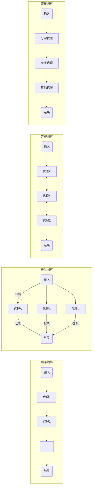

# AI Agent 与 Workflow 结合场景调研

## 执行摘要

本文对 AI
智能体（Agent）与工作流（Workflow）结合场景进行了系统调研，覆盖近年学术文献、行业白皮书、开源项目与实际案例。
首先明确研究范围与目标，并对典型场景分类：如智能体触发/执行工作流节点、智能体规划整个工作流、智能体动态重写
DAG、多智能体/多工作流协调、自适应弹性工作流，以及智能体在数据流、训练、CI/CD
和业务流程中的作用，及其安全/合规/审计交互等。
接着总结了常见技术模式与架构：控制平面/数据平面分离（如
Temporal）、可插拔执行器（如 Airflow/Prefect
AgentOperator）、策略引擎、回滚/事务语义、可观测性/可解释性模块等，并结合实例比较其优缺点。
进一步深入分析动态 DAG
规划问题，讨论了搜索/规划算法、强化学习与混合方法，并通过伪代码示例演示智能体如何生成或优化工作流。
针对多智能体并发场景，讨论了冲突检测与补偿事务设计。
最后评估了性能、可靠性与安全风险（如失效恢复、故障注入、审计跟踪、对抗性攻击等），并列举了
Airflow、Argo、Temporal、Prefect、Ray、LangChain 等系统如何支持 Agent
驱动工作流，以及迁移集成建议。
文中还提出了实验设计方案和未来研究方向，并给出优先阅读的论文和项目链接。

## 研究范围与目标

- **研究范围**：全面调研过去5年（2019–2026）学术文献、行业报告、开源项目和产品文档，关注
  AI 智能体与工作流结合的多样场景。
  文献检索包括 ACL/EMNLP/ICML/NeurIPS/AAAI 等会议文章及 arXiv
  预印本，工业资料涵盖官方博客、白皮书、案例研究（优先官方/原始来源）。  
- **主要目标**：理清 **场景分类**（各类 Agent-Workflow
  协作模式的定义、流程、关键组件、应用示例、代表性论文/产品），总结
  **技术模式与架构**（控制平面与数据平面分离、元编排、可插拔执行器、策略引擎、事务与回滚、可观测性/可解释性等），深入分析
  **动态 DAG 规划问题**（规划算法、约束求解、学习与强化学习方法、复杂度等）和
  **多智能体协调**（冲突检测、并发控制、一致性模型、补偿事务）；评估
  **性能/可靠性/安全**指标与测试方法（故障注入、回滚、权限审计、对抗风险）。
  同时调研 **工程实践与落地案例**，例如 Airflow、Argo、Prefect、Temporal
  等如何支持或限制 Agent 驱动工作流，并提出
  **迁移/集成建议**；最后给出可复现实验方案、验证基准与未来研究方向。  

## 场景分类

本文梳理了**AI 智能体与工作流结合的主要场景**，可分为：  

- **节点触发与执行**：智能体作为工作流中的 **任务执行者**或触发器。
  例如在 Airflow 或 Kubeflow DAG 中，某节点的执行动作由 LLM 智能体完成（如调用
  API、检索信息、生成报告等）。
  此类场景下，智能体行为受限于预定义 DAG
  结构，智能体本身不改变整体流程，仅驱动节点功能。
  常见流程：事件触发（如用户请求、消息队列）→ 智能体活动（工具调用、LLM 推理）→
  返回结果给下一节点。
  关键组件包括工作流引擎、Agent 接口（如 Prefect 的
  AgentOperator）、工具调用库。
  代表应用有 RAG 问答系统中用 Agent 调用检索工具，或按排程调用 ChatGPT
  等生成报告。
  相关参考：Airflow 的 PydanticAI 集成提供了 **Toolsets** 机制，将 Airflow Hook
  暴露为 Agent 可调用的工具。

- **智能体规划工作流**：智能体全局 **设计或重组工作流程**。
  这里智能体负责将复杂目标分解为子任务，并以 DAG 形式生成工作流计划。
  典型过程是：从目标描述（如自然语言）出发，智能体（如 GPT-4 的 Planner
  模型）通过搜索/规划算法构建任务
  DAG（节点为工具调用或子任务），然后交由工作流引擎执行。 关键技术包括
  DSL/结构化输出接口、图生成模型、强化学习（或混合训练）优化规划质量等。
  例如 Wei et al. 提出的 Planner 模型可将用户查询转换为最优的工具调用 DAG。
  代表论文还有“Agent Workflow Optimization
  (AWO)”利用元工具（meta-tool）将常见子图打包，提高多任务执行效率。
  典型应用场景是多步骤的自动化任务（如自动化编程、科研实验设计等），智能体先“画出”执行路线再逐步执行。  

- **智能体动态修改/重写 DAG**：工作流在运行过程中根据环境或中间结果动态
  **增删节点或变更依赖**。
  例如，智能体发现某任务失败或新数据到达时，可在线扩展原有
  DAG，插入或删除任务，或重新连接任务序列，形成 **自适应工作流**。
  此场景下，智能体需要对现有 DAG
  有感知能力，利用约束求解器或学习模型快速计算改动策略。
  关键组件包括动态 DAG 引擎（如 Ray Workflows、Argo Events）和在线优化模块。
  代表应用为监测/响应系统，如数据流水线遇到异常自动插入清洗步骤，或 CI/CD
  流程中根据测试结果调整后续步骤序列。
  技术上可借鉴 STRIPS/HTN 规划、增量约束求解等方法。

- **多智能体/多工作流协调**： **并发运行多个智能体**协同完成任务的场景。
  例如多个专业化智能体并行处理同一问题（多角度分析）或分工完成不同子问题，并通过协调器/对等协议交流与同步。
  典型流程包括：任务拆分后平行分配；代理各自运行并可能交互（如共享部分上下文）；结果聚合以形成最终输出。
  Azure
  例子中描述的并发编排模式（相当于并行扇出/扇入）显示，多个并行代理从不同角度分析同一股票，并将结果投票合并。
  另一种模式是群组会话（多人对话/辩论）：代理通过共享聊天线程协作，轮流发言解决问题。
  关键组件包括代理调度器、通信总线、汇聚策略（如投票规则）等。
  典型案例有智能客服系统中多agent协作决策，多agent编程助手共享代码生成。
  研究上有多agent路线（CrewAI 等），以及GraphRouter类模型做智能体路由。

- **自适应/弹性工作流**：工作流可以根据负载、故障或性能需求自动调整，智能体驱动这些调整。
  例如智能体可监测执行状况并触发流水线 **扩展/缩减** 或 **重试/回滚**
  策略，以提高可靠性。
  技术模式包括事务补偿设计（如 Saga 模式）、失败回退策略、智能重排优先级等。
  在 Temporal
  架构中，工作流具备可重放的持久性，当部分失败时可精确回滚到上一个检查点并重启后续步骤。
  在自适应工作流场景中，智能体也可能改变任务并行度或迁移任务到不同资源节点，以应对资源动态变化。
  实际应用如自动弹性伸缩的数据处理流水线或负载均衡逻辑。
  学术上与调度优化和鲁棒规划相结合，工业例子有 Kubernetes 与 AI
  结合的智能调度系统。

- **数据流/模型训练/CI/CD 中的智能体角色**：在数据预处理、模型训练、部署验证等环节引入智能体。
  典型场景如 MLOps 管道中，智能体可以通过对话界面或 API
  自动创建/修改训练流水线、管理数据版本等。
  Swarm Agent 案例采用多智能体结构集成 Kubeflow Pipelines 与 MinIO
  等工具，通过自然语言接口 **发现、运行和监控 ML 流程**。
  在 CI/CD 环境，智能体可自动生成测试、自动化部署管道，或作为代码审查助手。
  相关技术包括 AutoML
  的自动流水线生成（但一般预定义），以及结合对话接口和工作流控制的系统（如使用
  LLM 规划实验配置等）。

- **安全/合规/审计交互**：在高要求场景中，智能体与工作流需要满足安全审计与合规控制。
  此类场景包括对调用授权、操作日志审计、策略合规检查等交互。
  例如，引入最小权限模型保证智能体只能访问其被授权的系统资源（动态访问控制），并对智能体每次动作进行审计跟踪。
  智能体可能对安全策略进行询问或获得批准（人机复合路径），工作流引擎记录每步决策用于事后审查。
  典型技术如代理控制平面（Paperclip、IBM Control
  Plane）为多智能体系统提供审计、预算控制和验证机制。
  例如，Paperclip 的设计理念要求“每次决策和任务变更都必须记录”，确保可追溯；IBM
  则提出 Agent Control Plane 作为集中治理层，统一管理代理注册、规则与监控。
  此外，还需考虑对抗风险（提示注入、数据泄露等）及对应缓解（验证工具调用、异常检测等）。

**典型流程图示**：下图示意多种工作流模式下智能体的协同结构和信息流（以顺序、并发、群聊与移交模式为例）：



## 技术模式与架构

智能体工作流系统通常采用分层与组件化架构，常见模式包括：

- **控制平面/数据平面分离**：如 Temporal、Prefect 等将“控制层”与“执行层”分离。
  **控制平面**负责编排流程逻辑、持久化执行历史和监控（例如注册代理、分派任务、管理权限），而
  **数据平面**则是实际运行任务和工具调用的代理环境。 Temporal
  博客指出：工作流代码需确定性、可重演，而LLM决策在活动层执行，确保代理失败后可
  **恢复和续跑**。 IBM
  也强调控制平面是中心神经系统，负责统一部署、策略、审计；数据平面是代理运行场所。
  这种分离带来的优点是可持久化回放与审计日志，同时灵活支持非确定性决策；缺点是增加了系统复杂度，需要严格定义两层接口。  

- **元编排（Orchestrator-of-Orchestrators）**：在大规模场景，多级编排器用于管理多种工作流或智能体群。
  例如一个“元编排”可以监控多个工作流引擎（Airflow、Kubeflow
  等），并根据业务目标动态切换底层引擎或修改高层流程（类似混合云管控层）。
  关键组件包括统一 API、策略引擎和决策模块。
  此模式能提供跨系统协调，但实现难度高，常见于企业级自主平台。

- **可插拔执行器/工具集合**：系统应支持插件式工具调用框架，使智能体能够灵活调用各种服务。
  典型做法如 LangChain 提供工具接口，PydanticAI/AgentOperator 将外部 API
  封装为工具。
  Airflow 4.0 的 AI Provider 已经允许将其 Hooks 暴露给智能体，Prefect 也与
  Pydantic AI 集成，使每次 LLM 调用和工具调用成为 Prefect 任务。
  这种模式优势在于可快速扩展新功能，但需注意接口类型定义与安全控制。  

- **策略引擎**：专门的策略/规则模块控制智能体行为，比如资源分配、任务优先级、预算限制等。
  Paperclip 中引入了预算控制和任务生命周期管理；IBM
  控制平面强调策略执行前进行权限校验。
  策略引擎通常与控制平面耦合，可动态调整不同场景下智能体的约束。  

- **回滚与事务语义**：为了可靠性，需要为长流程提供故障补偿或事务语义。
  例如 Saga 模式或二阶段提交可以应对部分失败。 Prefect/Temporal 支持
  **持久化重放**：已完成步骤可缓存结果，出现失败仅重试剩余任务。
  例如，Prefect 通过任务级缓存避免重复调用，Temporal
  则在事件历史中记录决策并继续执行。
  这些机制提高了鲁棒性，但要求严格控制副作用。  

- **可观测性与可解释性模块**：对智能体工作流尤为重要。
  需要日志、监控和可视化界面追踪每个决策和任务。
  Prefect、LangSmith 等提供 Web 仪表板显示任务执行详情；Paperclip
  要求完整审计日志。
  此外，对智能体决策过程的可解释性也在研究中被关注，如在决策时生成可验证凭证或解释提示。

| 架构模式        | 核心功能                                     | 优点                              | 缺点及适用场景                 |
| --------------- | -------------------------------------------- | --------------------------------- | ------------------------------ |
| 控制/数据分离   | 控制平面负责策略、调度，数据平面运行实际任务 | 容错性高、易审计；支持非确定性LLM | 系统复杂度高，需可靠的恢复机制 |
| 元编排（上层）  | 顶层协调多个工作流引擎/Agent集群             | 跨平台协调，统一视图              | 实现复杂，适用于大规模企业环境 |
| 可插拔工具集    | 通过插件/Hook提供多样化工具调用              | 扩展方便，接口一致性好            | 接口管理和安全开销             |
| 策略引擎        | 权限校验、预算管理、优先级等                 | 灵活控制智能体行为                | 需根据场景设计复杂策略         |
| 可观测性/可解释 | 全流程日志、状态追踪、可视化界面             | 提高可调试性和信任度              | 需要额外存储和展示成本         |

图：典型架构模式比较（控制面 vs 数据面、元编排等）

## 动态DAG与规划问题

**动态DAG**指工作流结构可随运行时信息而变化，由智能体负责 **生成、优化或重写**。
相关关键技术包括：

- **规划与搜索算法**：经典 AI 规划算法（如
  A*/BFS、启发式搜索）和启发式规划用于生成 DAG。
  例如令智能体维护子任务队列，在每步根据状态选择下一个任务并加入 DAG：  

  ```python
  def plan_workflow(goal, context):
      DAG = []
      while not goal.achieved():
          task = agent.decide_next_task(context)
          DAG.append(task)
          context.update(execute(task))
          if inconsistency_detected():
              backtrack_or_replan(DAG, context)
      return DAG
  ```

  其中 `agent.decide_next_task` 可基于启发式规则或学习模型。
  也可采用 **分层任务网络（HTN）**：先在高层规划出任务序列，再细化为 DAG。
  Wei 等人利用 GPT-4 微调构建全局 DAG 规划器。  

- **约束求解与优化**：生成 DAG 时需考虑资源、成本、依赖等约束。
  可建模为混合整数规划或 SAT 问题求解，或使用 CSP/ILP 算法。
  学习驱动方法如元学习可根据历史经验快速预测近似最优结构。
  若应用 RL，可将规划看作连续决策：智能体状态为部分构建的
  DAG，动作为添加某工具节点，奖励为规划质量。
  ComplexTool-Plan 框架中使用结构化奖励和混合训练（监督+RL）提升 Planner
  准确性。

- **在线调整**：在长流程执行中，智能体可能需要 **动态修改**DAG。
  策略包括增量更新与延迟再规划：一旦检测到约束变化或节点失败，智能体重新运行规划模块，插入新节点或重新连接。
  例如 Temporal
  利用事件历史快速定点恢复并继续当前策略；也可以通过补偿事务（回滚前一步）再插入替代任务。
  算法上，可用增量搜索或后悔机制（如实时 A*）。  

- **复杂度与可扩展性**：一般工作流规划为 NP-难问题。
  组合数目随任务数量指数增长，需启发式近似或并行化处理以保证扩展性。
  实现时通常简化任务粒度或预定义公用子流程来限制搜索空间。
  AWO 框架通过识别重复子结构，将多步序列压缩为
  **元工具**（单次调用）来降低复杂度。

- **示例伪代码（动态规划+RL）**：  

  ```python
  for episode in range(N):
      context = initialize_context()
      while not done:
          action = policy(context)  # RL策略或规划器生成下一个子任务
          next_state, reward, done = env.step(action)
          update_DAG(action, next_state)
          learn_from_feedback(context, action, reward)
          context = next_state
  ```

- **应用示例**：例如在软件构建自动化中，智能体先规划构建/测试顺序，再在过程中根据测试结果插入回归测试或优化任务。
  论文中，图示表明复杂查询生成 **并行化执行计划**DAG（图1）。 动态 DAG
  能显著提升多步骤任务性能和灵活性，但要求智能体具备可靠的规划与实时决策能力。  

## 协同与冲突解决

多智能体并发运行时容易产生资源或任务冲突。 协调机制包括：  

- **冲突检测**：监控多个代理对共享资源（数据、API 限额等）的访问。
  常用方法有锁（Lock）、版本号或原子操作检测。
  如果两个代理尝试修改同一状态，触发冲突处理。 Temporal
  的确定性执行通过回放事件历史避免并发差异；其他框架可采用乐观并发控制，冲突时重试或转交。  

- **任务分配与一致性**：使用全局任务队列或租约机制防止任务重复执行。
  例如对只有一个处理者的任务，先到先得锁定，其他代理跳过。
  必要时可用 **分布式锁服务**（如 ZooKeeper、Redis Redlock）实现严格互斥。
  对于输出整合，需定义一致性协议（如多数投票、扁平同步）保证最终结果一致。  

- **补偿事务设计**：若事务性任务失败，需要回滚前阶段操作。
  可采用 Saga 模式：每个子任务对应补偿操作。
  若中间失败，依次执行补偿以撤销先前任务，并生成替代任务。
  本文档中 Prefect/Temporal
  的持久化执行正是通过任务缓存和重放来避免全局回滚的例子。  

- **一致性模型选择**：根据应用选择强一致或最终一致。
  分布式代理间协作常选用最终一致（各自独立执行，最后聚合）；若任务需要严格顺序执行，则使用强一致性（如排序队列或控制节点）。  

- **示例**：在上节并发编排的股票分析示例，四个代理独立工作，结果合并前需检测矛盾。
  如果技术分析和基本面分析给出相反建议，可能触发仲裁（如语言模型生成统一意见）。
  在多工作流场景，可能出现多个代理对同数据记录进行竞争性更新，这时可先行协调代理角色或分片数据以减少冲突。

## 性能、可靠性与安全

**评估指标**：包括吞吐率（并发任务数/时间）、响应时延、任务成功率、失败恢复时间、资源利用率、成本开销等。
对 Agent 规划的效果，可加上计划质量指标（如 DAG
长度、并行度、优化度）和正确性（任务完成率）。  

**测试方法**：利用
**故障注入**评估鲁棒性，例如在工作流运行时故意断网、使某节点异常，以测试恢复与自动重试能力。
Temporal/Prefect 提供任务级别缓存和重试策略可应对此类故障。
观测系统应能实时报告Agent状态和日志。
可采用Chaos Engineering实践引入混沌故障，验证回滚与事务补偿设计。  

**回滚与补偿**：为保障可靠性，工作流应支持从失败中 **回滚或补偿**到安全状态。
常用模式如
Saga（看到一步失败就执行先前步骤的逆操作）或使用工作流引擎的持久化历史重放功能。
抽象交易也可用于多阶段提交，每阶段成功后持久化状态，阶段失败则自动补偿。
引用 Temporal 和 Prefect 示例，已执行步骤结果可缓存，不必从头开始。  

**权限与审计**：严格的 **权限管理**对于 Agent 至关重要。 应对智能体的
**工具调用与数据访问**实施细粒度控制（如基于角色的授权、动态策略）。
例如，IBM Control Plane 提到控制平面会在执行前强制策略，并记录操作。
审计模块需记录智能体的每次决策、工具使用和数据修改，形成不可篡改的日志链，以便合规检查或追责。  

**对抗风险与缓解**：Agentic 系统引入新威胁：例如提示注入可能导致 Agent
执行未授权操作；多Agent间通信的泄露风险；和代理记忆泄露敏感数据。
缓解措施包括：对输入执行严格过滤；使用白名单工具和限制工具功能；实时行为监控检测异常；细分权限避免级联泄露。
现代安全框架（如 NIST AI RMF）可借鉴，但需要特别针对智能体的“自决”特性。

## 工程实践与落地案例

主流工作流和 Agent 平台对智能体驱动场景的支持不尽相同：

- **Apache Airflow**：传统静态 DAG 引擎。
  近期引入 AI 工具集（Airflow AI Provider）允许在任务中使用 Agent。
  例如官方文档说明，可以将 350+ 个 Hook 封装为 PydanticAI **Toolset**，让 LLM
  代理在多回合推理中调用数据库、API 等工具。
  开发者可以在 DAG 中使用 `AgentOperator`，将 Agent 与这些 Toolset
  结合，执行复杂逻辑。
  示例代码展示了如何在任务中创建 PydanticAI Agent 并运行查询。
  总结：Airflow 本身依旧要求在 DAG
  解析阶段定义任务（静态结构），但可通过在任务中嵌入 Agent 来灵活执行工具调用。
  迁移建议：在现有 DAG 中谨慎增加 Agent 任务，注意 Airflow
  的解析限制与死循环风险。  

- **Argo Workflows**：Kubernetes 原生的 DAG 引擎，支持由 YAML 定义流水线。
  Argo 本身暂无内建 AI Agent 功能，但可通过 Argo Events/Workflows
  的自定义容器任务运行智能体逻辑。
  由于 Argo 侧重容器化流水线，可将 Agent 模型部署为微服务，在工作流某节点调用。
  需要手工处理任务失败回调与动态 DAG 的逻辑。
  建议使用 Argo Rollouts/Events 配合外部调度器实现动态触发。  

- **Temporal**：面向业务的持久化工作流框架，非常适合 Agent 场景。
  Temporal 要求 Workflow 代码确定性，但强调控制流的可重放性。
  其特点是内置 **可恢复执行**：智能体的决策作为历史记录，可在崩溃后准确重演。
  OpenAI Codex 等大规模 Agent 系统都在用 Temporal 作为底层执行引擎。
  因此，Temporal 非常适用于长期运行的动态 Agent 计划。
  工程注意：需编写确定性 Workflow 代码，将所有外部调用放在 Activity
  中；同时设计好上下文状态存储。
  迁移建议：将关键流程转到 Temporal
  Workflow，可以利用其事务/补偿语义和内建监控。  

- **Prefect**：新兴 Python 工作流框架。
  Prefect 通过与 Pydantic AI 集成提供了 **Agent生产就绪**支持。
  在 Prefect 中，一个 PydanticAI 智能体可以被包装为 Prefect Flow，在 Flow
  内部每次 LLM 调用和工具调用都是独立 Task，支持自动重试、缓存和可视化监控。
  示例：通过 `PrefectAgent` 包装原始 Agent 实例，即可调用
  `prefect_agent.run(...)` 将 Agent 执行为 Prefect Flow。
  优点是快速接入（纯 Python）、可利用 Prefect Cloud/OSS 的 UI
  追踪；缺点是生态较新。
  建议：对于 Python 项目，可采用 Prefect 加速 Agent
  部署，并利用其任务级别恢复减少成本。

- **Ray**：分布式计算框架，天然支持并行 Agent 工作流。
  通过 `@ray.remote` 声明的函数可构建任务图，支持批量并行执行。
  Ray 近期推出的 **Workflows**
  模块提供了持久化和条件嵌套能力，可用于动态扩展工作流。
  MotleyCrew 案例演示了如何用 Ray 的 DAG 模式并行生成博客及插图。 Ray
  的优点是易于横向扩展，缺点是缺乏默认的任务重试策略和审计，需要开发者手动实现。
  建议：可用 Ray 运行大规模并行 Agent 任务，结合 Ray Workflows
  实现耐久执行；注意实现失败恢复逻辑。

- **LangChain 系列**：框架层面支持多 Agent 和工作流。
  **LangChain** 本身通过 Chain/Agent 接口调用工具，但需要自行管理执行流程；
  **LangGraph** 则添加了图执行、持久化、调试等功能。
  LangChain/LangGraph 可用于构建规划逻辑、工具调用模型，但缺少独立的调度引擎。
  建议将 LangChain 作为 Agent 逻辑库，与上述工作流平台集成。
  还有诸如 AutoGen、ChatDev、CrewAI、MetaGPT 等多 Agent
  工具栈，适合快速原型，但通常规模化时需要加固基础设施。  

- **AutoML 与 MLOps 平台**：如 Kubeflow、MLflow、Meta AutoML
  等自带流水线自动化功能，但传统上更关注模型自动搜索，不偏向智能体式动态规划。
  Swarm Agent 示例表明可用智能体对接 Kubeflow Pipelines 管道。
  企业 MLOps 平台（AWS SageMaker Pipelines、Azure ML）亦可在任务节点中触发
  Agent。
  建议：在 MLOps 中引入 Agents
  时，注意数据和模型版本追溯；使用类似实验仪表板记录 Agent 决策过程。  

- **其他案例**：Workflow 平台 n8n/Make 等无代码工具正在尝试 AI
  代理特性，如自动表单路由。
  企业应用如 ServiceNow AI Agent、SAP AI 工作流等正探索智能体辅助流程。  

**集成建议**：迁移现有工作流时，可先从“小粒度”入手——
将 Agent 作为单独可插拔的工具任务嵌入现有 DAG，再逐步扩展到全局规划。
务必考虑安全边界（隔离试验）、版本管理以及与人工作业（HITL）的接口。
总体而言，选择平台应基于需求：长期动态任务推荐
Temporal/Prefect；并行可伸缩任务推荐 Ray；轻量级快速部署推荐 Airflow 加
AgentOperator。

## 实验设计与验证

要验证 Agent 规划与动态 DAG 效果，可设计如下**可复现实验方案**：

1. **基准任务和数据集**：构造多步骤任务集，如自动旅行规划（选航班、预订酒店）、电商问题回答（查询库存、下单、发票生成）等；或使用公开
   Agent 评测基准（如 *StableToolBench*、 *AppWorld* 等）。
   准备多个任务难度级别，从简单线性流程到复杂分支任务。
   数据集可包括实际 API（天气、地图等）和虚拟环境。  

2. **对比方法**：设计多个实验组：  
   - 静态工作流基线：预定义 DAG，无智能体规划。  
   - 反应式 Agent（ReAct）按步骤决策，不全局规划。  
   - 规划型 Agent：使用各种规划算法（纯启发式、搜索、RL-trained Planner）。  
   - 多-Agent 协作：加入并行/会话形式的多智能体设置。  

3. **评价指标**：包括 **成功率**（完成任务的比例）、 **运行时间/延迟**、
   **LLM 调用次数**（成本）、 **DAG 大小/并行度**（资源利用）、
   **错误恢复能力**（故障后的完成度）。
   对于规划质量，可评估生成 DAG 的最短路径长度和冗余程度。
   记录失败场景（如超时、错误输出）。  

4. **可观测性与可视化**：记录每个任务的执行图（如使用 Prefect/Ray
   的可视化），以及日志中的时间线。
   可生成甘特图或流水线图对比各方案执行过程。
   推荐使用 LangSmith 等工具以可视化 agent 内部决策链。  

5. **实验流程示例**：以酒店预订任务为例：随机生成 N
   个查询需求，让各实验组运行并记录结果。
   实验可采用蒙特卡洛评估智能体在资源限制下的行为差异。 可写伪代码：

   ```python
   for seed in range(S):
       query = sample_travel_request(seed)
       plan1 = static_workflow.solve(query)
       plan2 = react_agent.solve(query)
       plan3 = planner_agent.solve(query)
       record_metrics(seed, plan1, plan2, plan3)
   analyze_results()
   ```

6. **对抗与安全测试**：对智能体输入加入对抗性示例或异常数据，测试系统的健壮性和安全策略。
   例如，对 Agent 注入不合法命令，看控制平面能否阻断。  

通过此实验流程，可以评估 Agent 规划系统的有效性和稳定性。  

## 未来研究方向与路线图

**短期（1–2 年）**：  

- 研究 **基准**和 **评价体系**：制定标准化的 Agentic Workflow
  Benchmarks，用于比较不同算法与架构性能。  
- 探索
  **混合编排**模式：将静态工作流与智能体结合的混合策略，逐步引入动态规划能力。  
- 开发 **安全框架**：为 Agent
  驱动系统制定安全/合规最佳实践，如权限沙箱和攻击检测方法。  
- 工具与平台支持：优化开源框架（如 Prefect、Temporal）对 LLM Agent
  的内建支持，实现更简单的失败恢复和监控。  

**中期（3–5 年）**：  

- **多智能体体系**：研究大规模、多场景下多 Agent
  协作的协调模型（例如博弈论机制、动态角色分配）和可扩展控制平面设计。  
- **自适应规划算法**：结合元学习和强化学习，增强 Agent
  的在线规划效率；发展支持实时约束的规划算法。  
- **可解释与可验证**：深入研究 Agent
  决策可解释性，使工作流输出可验证，满足高风险领域（医疗、金融等）需求。  
- **工业落地与商业化**：推动智能工作流在重点行业（医疗、制造、金融）的试点应用；形成成熟的商业方案和咨询方法。  

**长期（5+ 年）**：  

- **完全自主工作流**：实现无需人为干预的端到端自动化系统，真正意义上的自主实验室或企业流程（可参考
  SciFlow 论文中的“autonomous science”愿景）。  
- **统一治理生态**：构建跨厂商、跨平台的智能体控制平面标准，实现企业级多 Agent
  环境的互操作性与安全合规框架（类似云计算时代的 Kubernetes）。  
- **新兴范式**：探索超越 DAG 的结构（如因果图、智慧流）与 Agent 结合的可能，利用
  AI 构建 **自演化工作流**。  

**优先阅读论文（学术）**：Difficulty-Aware Agent Orchestration、Beyond ReAct 的
Planner 模型、优化 Agentic Workflow 的 AWO、科学工作流转向自治的综述、Swarm
Agent MLOps 系统。  
**优先关注项目/文档（工业）**：Airflow AI Toolsets、Temporal 动态 AI Agent
博文、Prefect 与 Pydantic AI 集成、IBM Agent 控制平面介绍、MotleyCrew Ray
Agentic Workflow 案例。  

通过上述内容的分析和引用，本文为 AI Agent 与 Workflow
结合领域提供了综合而深入的视角，希望能为学术研究和工业实践提供参考与指导。
